# marketplace_api

## Introduction
The marketplace API is backend application that contains the basic functionality necessary for an eCommerce website. For example, a user may
* sign-up
* login
* query products from the store (either one at a time or all at once)
* add items to their cart
* remove items from their cart
* view the metadata in their cart (owner, subtotal, total, number of items, and all carted items)
* checkout their cart


## Technical Overview
This repository contains the code for the market_api application written in [Node.js](https://nodejs.org/en/). The application ultizes [GraphQL](https://graphql.org/) which is a query lanuage for the API that alllows the user to clearly and easily define what type of data they want to receive. As for storing persistent data, the application uses a [MySQL](https://www.mysql.com/) instance and uses [Sequelize](http://docs.sequelizejs.com/) as a ORM tool to interact with the database. 

## Security
The API is secured by utilizing [JWT](https://jwt.io/). When a user signs-up or login, the API will  automatically create `Cart` instance in the database and will return JWT that contains the data for that cart. The user may now include this JWT as a **Bearer Token** in their request headers and will have access to modifying their cart. This allows users to signup or login (using a username & password) into their own cart. Users will not have access to each other's carts unless they somehow get a user's JWT (or username & password).

How does the Authorization work within the server? Since GraphQL has only one endpoint, which all the requests are made through, I simply made a **authorization middleware** to that endpoint. Just as with REST, the JWT will check if an Authorization header with a valid token is available on every request made to the endpoint. If so, then we decode it a `User` object (which is actually just a `Cart` object) to the requet. Then, I simply added an authorization check at the resolvers I wanted to secure, and boom! Each endpoint is only accessible to the right users with valid credentials.


## Database Schema
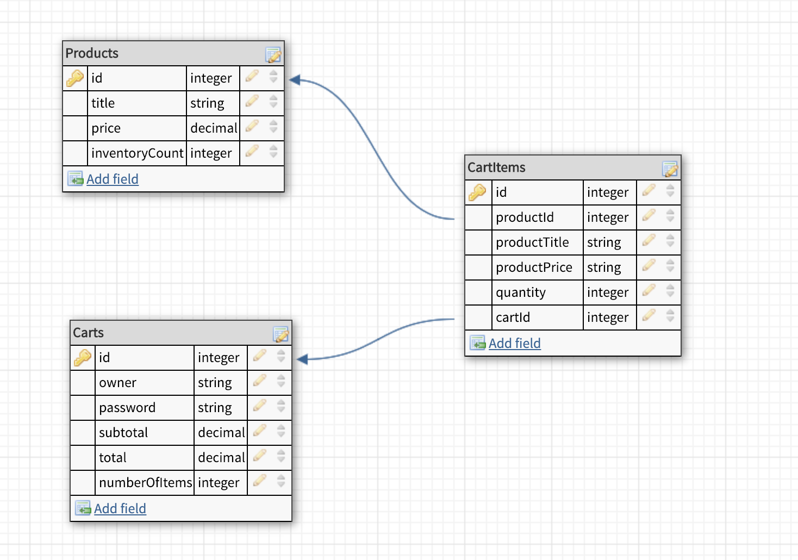

## API Usage

### Types
You can include any of these attributes in your API query to receive back the exact data you asked for.

`Product` { **id**: Int, **title**: String, **price**: Float, **inventoryCount**: Int }

`CartItem` { **id**: Int, **cartId**: Int, **productId**: Int, **productTitle**: String, **productPrice**: Float, **quantity**: Int }

`Cart` { **id**: Int, **owner**: String, **subtotal**: Float, **total**: Float, **numberOfItems**: Int, **cartedItems**: [CartItem]}

### Product Queries
| Method               | Description                                                     | Params                             | Return Type  | Requires JWT   |
| -------------------- |:----------------------------------------------------------------| :---------------------------------:| ------------:| -------------: |
| getOneProduct()      | Returns the product with the corresponding productId            | id: Int!                           | Product      | No
| getAllProducts()     | Returns an array of all products. If boolean `onlyAvailableInventory` is true, it will only return all the products with available inventory (where inventoryCount != 0) | onlyAvailableInventory: Boolean!   | \[Product\]  | No

### Cart Queries 
| Method               | Description                                                | Params      | Return Type    | Requires JWT  |
| -------------------- |:----------------------------------------------------------:| -----------:| --------------:| -------------:|
| getCart              | Returns the corresponding cart with its respective JWT     | None        | Cart           | Yes           |

### Cart Mutations
| Method               | Description                                                | Params      | Return Type    | Requires JWT  |
| -------------------- |:----------------------------------------------------------:| -----------:| --------------:| -------------:|
| login()              | Returns a JWT with the associated cart metadata associated    | owner: String!, password: String!        | String (JWT)   | No            |
| signup()             | Creates a new `cart` entity and returns a JWT with the associated cart metadata associated    | owner: String!, password: String!        | String (JWT)   | No            |
| addItemToCart()      | Searches for the productId and adds it into cart    | productId: Int!, quantity: Int!        | Cart           | Yes           |
| removeItemFromCart() | Searches for product in cart and removes it    | productId: Int!        | Cart           | Yes           |
| checkoutCart         | Checks out the cart by validating and decrementing the `inventoryCount` of all the `cartItem` in the cart     | None        | String         | Yes           |


## Get Started (Setting Up Locally)
Setting up **marketplace_api** is pretty simple. The two main compontents of this application is the backend server and the database server. The following steps will help you run the server locally, run a MySQL instance locally, and use [Insomnia](https://insomnia.rest/graphql/) for endpoint testing.

1. Clone this repository.

```
git clone https://github.com/enochtangg/marketplace_api.git
```

2. Change into marketplace_api directory
```
cd marketplace_api
```

3. Install dependencies from npm
```
npm install
```

4. Make sure you have MySQL install into your machine. You can check by using:
```
mysql -V
```

5. If you do not have MySQL installed, you can install it using homebrew by following the steps [here](https://gist.github.com/nrollr/3f57fc15ded7dddddcc4e82fe137b58e).

6. Once MySQL is installed, you want to set the root password for your local instance. **For testing purposes, set password to 'password'**. If you want create your own password, remember to change the *DATABASE_PASSWORD* variable in the [.env](.env) file of this repository.
```
brew services start mysql
mysql -u root
mysql> CREATE DATABASE marketplace;
mysql> USE mysql;
mysql> ALTER USER 'root'@'localhost' IDENTIFIED BY 'password';
mysql> FLUSH PRIVILEGES;
mysql> quit

```

7. Lastly, run the server. Once the server starts, it will execute a bunch of raw queries to populate the Products table so you may play around with the carting items.
```
npm start
```

## Demo
To test and play around with the API, I recommend using the Insomnia to make requests. Insomnia is essentially Postman, but for GraphQL. Install [here](https://insomnia.rest/graphql/). You could also use to built in graphiql interfact at http://localhost:9000/graphql but that does not allow you to add a JWT into the Bearer Token Header so you wont be able to access the bulk of the endpoints.

1. Creating a new request named "Shopify Challenge Test" that is a POST request and takes in a GraphQL as body.
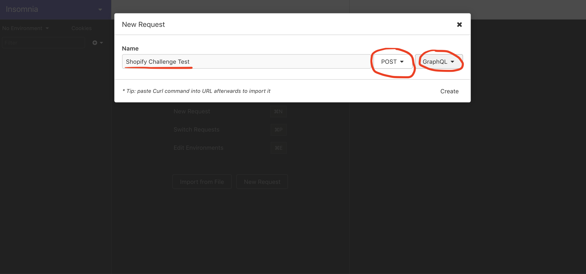


2. Querying all products in the store. Notice how we did not need any authentication to query products.
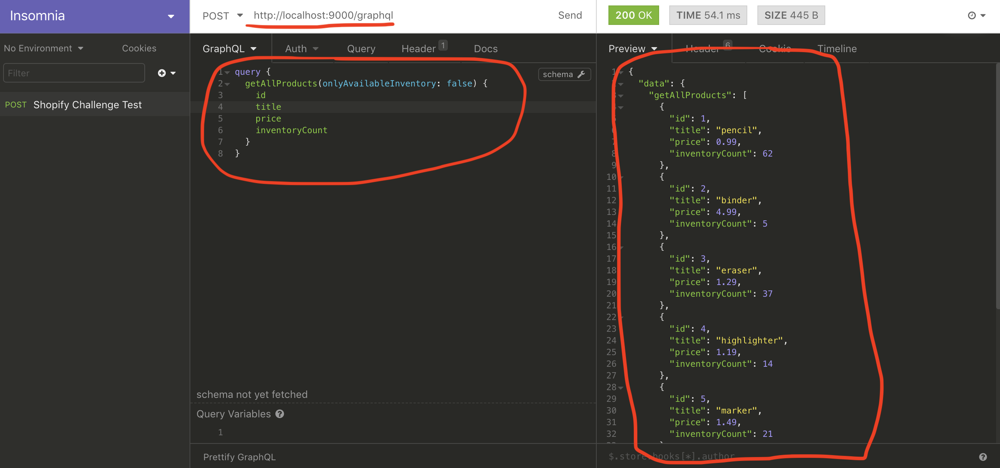


3. Notice how once we call a endpoint that requires a JWT, we get a unauthorized error.
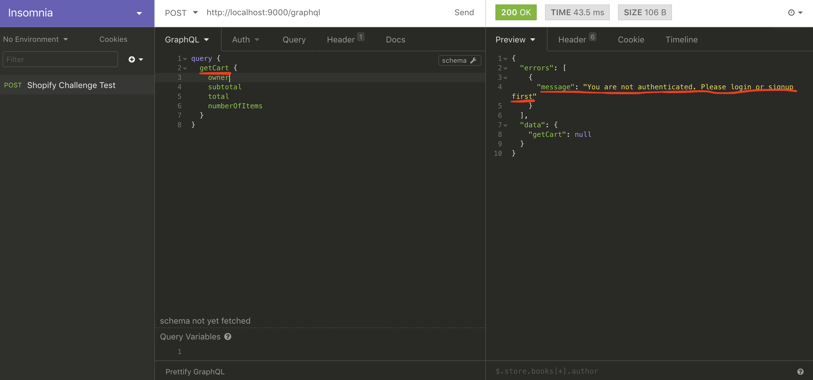


4. Using the signup endpoint to create a user (cart) with a owner name: "Shopify Test" and a password: "password". Notice how the server returned a JWT to us.
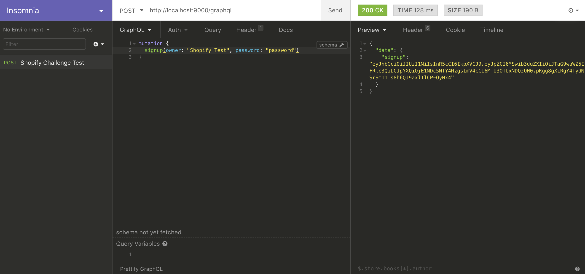


5. Heading over to the Auth tab and pasting JWT as a Token Bearer for all our prior requests.
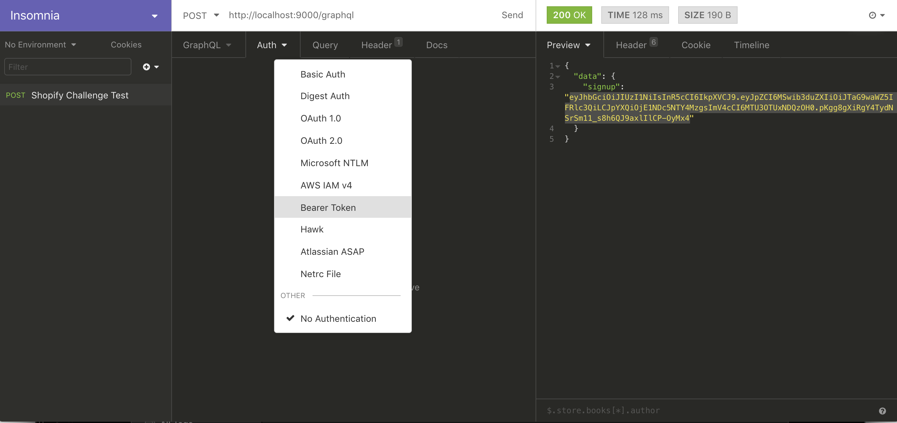


6. Added an item to our cart. Here I added the item with productId "2" which was a "binder". I can also specify how many I want to add as quantity of "10". Notice, that the response automatically updates my subtotal, total and numberOfItems in my cart as well as an array of all my carted items. I can also remove items from my cart with the removeItemFromCart() endpoint. 
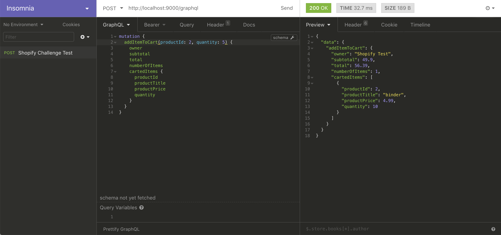


7. If you look at the first screenshot when we queried all the items. The product "binder" only had 10 avaible in its inventoryCount and I have added 10 in my cart. So, when I try to checkout, I get an error saying that the product is sold out.
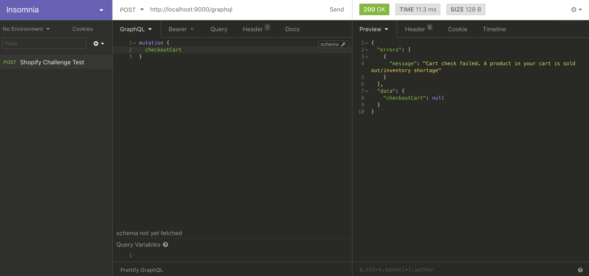


8. Let's try again with these items.
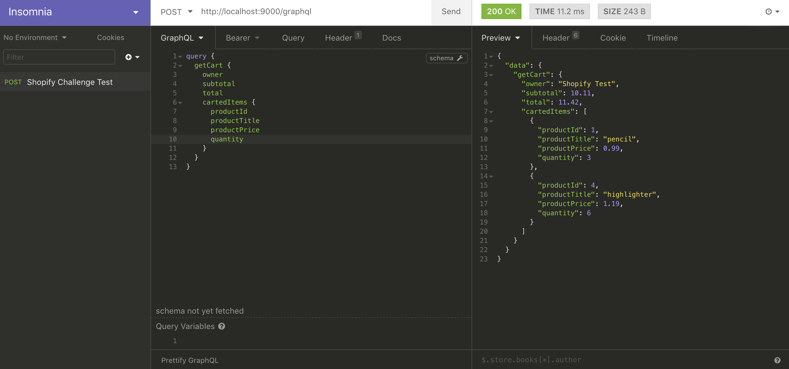


9. Since there is enough items in stock for us to purchase, we get a success message!
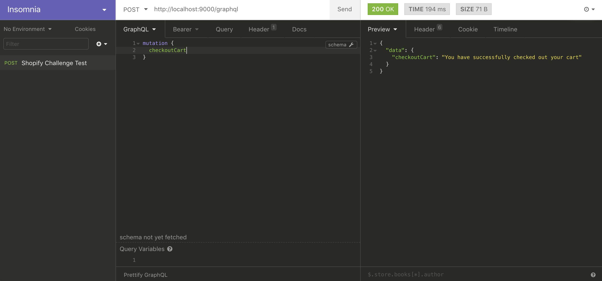


10. Notice how when we query the products again, the inventoryCount of the products we just checked out has been decremented by the quantity we purchased.
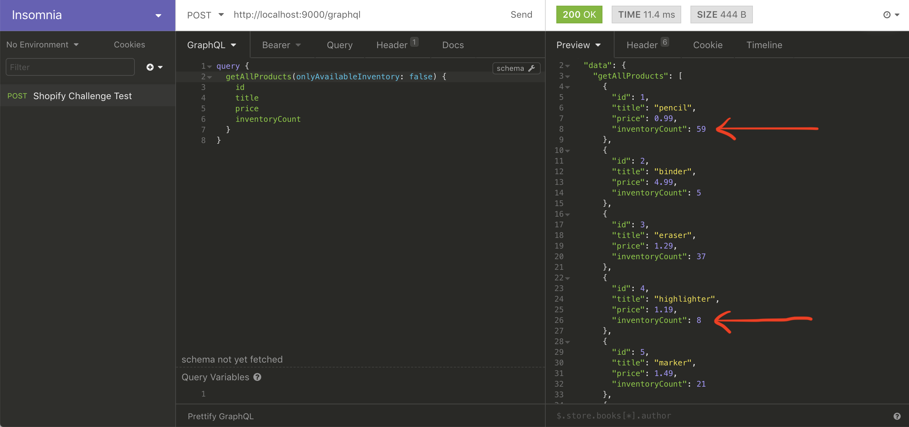


## Error Handling
I have implemented more custom error handling (eg. trying to cart an item that doesn't exist, logging in with wrong password, and etc.) which can all be found in the [error.js](src/utils/errors.js) file.


## Next Steps
Although this project is for a Shopify Challenge to replicate the backbones the backend API of a eCommerce website,  some future steps I would like to incorporate is the following:

* Containerize this application with Docker for deployment in any cloud service
* Add more functionality to this API 
* Think about how we would scale this application (distributed databases with replication or partitioning, handling concurrent queries to database, etc.)
* Write test cases